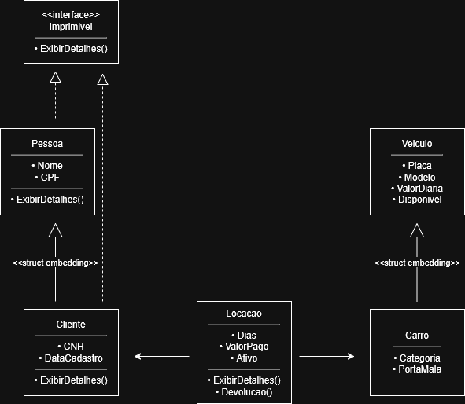

# Sistema de Gestão - Locadora de Veículos

Trabalho prático da disciplina de Programação Orientada a Objetos. 

## Sobre o Projeto
Este estudo de caso consiste no núcleo de um sistema de gestão para uma locadora de veículos. O objetivo principal é controlar a frota, gerenciar o status de disponibilidade dos carros em memória e automatizar o processo de locação e devolução, aplicando regras de negócio de descontos e multas de forma autônoma.

Linguagem Escolhida: Go (Golang)
Como a linguagem Go não adota o paradigma tradicional de Orientação a Objetos (sem o uso de classes estritas e herança via palavra reservada), os conceitos de Herança e Polimorfismo foram implementados utilizando Composição (Struct Embedding) e Interfaces.

## Atendimento aos Requisito
O sistema atende a as seguintes exigências propostas para o estudo de caso:

* 5 Classes de Domínio Relacionadas: `Pessoa`, `Cliente`, `Veiculo`, `Carro` e `Locacao`.
* Herança: Aplicada via Struct Embedding (`Cliente` herda de `Pessoa`; `Carro` herda de `Veiculo`).
* Associação: A struct `Locacao` agrega instâncias independentes de `Cliente` e `Carro`.
* Construtores: Utilização de funções de inicialização personalizadas para manipulação de memória (ex: `NovoCliente`, `NovoCarro`, `NovaLocacao`).
* Sobrescrita e Substituição: Utilização da interface `Imprimivel` e o método `ExibirDetalhes()`, implementado na superclasse (`Pessoa`) e sobrescrito na subclasse (`Cliente`).
* Regras de Negócio (2 métodos exigidos):
  1. Regra de Desconto: Cálculo do valor total com aplicação de 10% de desconto para locações superiores a 7 dias.
  2. Regra de Multa e Liberação: Processo de devolução com aplicação de multa punitiva (dobro da diária base) por dia de atraso, e liberação automática do status de disponibilidade do veículo para novos clientes.
* Fluxo de Execução: Simulação completa em ambiente de console, instanciando, alterando e trocando mensagens entre os objetos em tempo de execução.

## 🏗️ Diagrama de Classes (UML)

Abaixo está a representação arquitetural do nosso domínio de objetos:

    %% Realização de Interface
    Imprimivel <|.. Pessoa
    Imprimivel <|.. Cliente
